#  Proyecto Backend con PHP
#  📚 Listado de Libros

Este proyecto permite **crear, leer, actualizar y eliminar libros**, asociando cada uno a su respectivo autor.

---

## Proyecto desplegado en 
https://crud-render-5cwy.onrender.com

---
## 📂 Estructura base del proyecto

```
CRUD
├─ .dockerignore
├─ .editorconfig
├─ app
│  ├─ Http
│  │  └─ Controllers
│  │     ├─ Controller.php
│  │     └─ LibrosController.php
│  ├─ Models
│  │  ├─ Autor.php
│  │  ├─ Libros.php
│  │  └─ User.php
│  └─ Providers
│     └─ AppServiceProvider.php
├─ artisan
├─ bootstrap
│  ├─ app.php
│  ├─ cache
│  │  ├─ packages.php
│  │  └─ services.php
│  └─ providers.php
├─ composer.json
├─ composer.lock
├─ conf
│  └─ nginx
│     └─ nginx-site.conf
├─ config
│  ├─ app.php
│  ├─ auth.php
│  ├─ cache.php
│  ├─ database.php
│  ├─ filesystems.php
│  ├─ logging.php
│  ├─ mail.php
│  ├─ queue.php
│  ├─ services.php
│  └─ session.php
├─ database
│  ├─ database.sqlite
│  ├─ factories
│  │  └─ UserFactory.php
│  ├─ migrations
│  │  ├─ 0001_01_01_000000_create_users_table.php
│  │  ├─ 0001_01_01_000001_create_cache_table.php
│  │  ├─ 0001_01_01_000002_create_jobs_table.php
│  │  ├─ 2025_06_22_020513_create_autor_table.php
│  │  └─ 2025_06_22_020519_create_libros_table.php
│  └─ seeders
│     └─ DatabaseSeeder.php
├─ Dockerfile
├─ package.json
├─ php.ini
├─ phpunit.xml
├─ public
│  ├─ .htaccess
│  ├─ favicon.ico
│  ├─ index.php
│  ├─ info.php
│  └─ robots.txt
├─ README.md
├─ resources
│  ├─ css
│  │  └─ app.css
│  ├─ js
│  │  ├─ app.js
│  │  └─ bootstrap.js
│  └─ views
│     ├─ layouts
│     │  └─ app.blade.php
│     ├─ libros
│     │  ├─ actualizar.blade.php
│     │  ├─ crear.blade.php
│     │  ├─ eliminar.blade.php
│     │  └─ leer.blade.php
│     └─ welcome.blade.php
├─ routes
│  ├─ console.php
│  └─ web.php
├─ scripts
│  └─ 00-laravel-deploy.sh
├─ storage
│  ├─ app
│  │  ├─ private
│  │  └─ public
│  ├─ framework
│  │  ├─ cache
│  │  │  └─ data
│  │  ├─ sessions
│  │  ├─ testing
│  │  └─ views
│  │     ├─ 23c309d903f7399e978da8e403a5be5c.php
│  │     ├─ 2591184e2a688dd7778d49eddeb9ab8b.php
│  │     ├─ 26f1df46261b9bf504004007ce81af9d.php
│  │     ├─ 278b5fbad031effb7b5ff750bd826a5d.php
│  │     ├─ 32926fe3e132ee31bf5addaa94684a2d.php
│  │     ├─ 4968ee0394a1efa9df95880710511776.php
│  │     ├─ 4f2d1c88ff50419f6c35ba7b0b8b134a.php
│  │     ├─ 654694424c26410813cbb52f6e9c4b0b.php
│  │     ├─ 6a7a6846e227e21ea5a19a1c67ddda9b.php
│  │     ├─ 6a8a6c4ad6c551f60e51853f5a24965a.php
│  │     ├─ 6fdc3c3fbdc3db8cd6834e6b9167d754.php
│  │     ├─ 70c1e1898254a6d143c474d07feaaed0.php
│  │     ├─ 78d0c4b78dd4302ab9812f35c2572766.php
│  │     ├─ 8158fbc218d08798c9f50b5d136ff9e4.php
│  │     ├─ 869a35278440576691986c737ee84040.php
│  │     ├─ a90796d25076a8dc4563e5157ca9a254.php
│  │     ├─ c3c2fd8944b5bba45f6f96587ef1d5b7.php
│  │     ├─ d301c58b42517b79af18d3e260e584ad.php
│  │     ├─ d6d4510dc447152bbfd1482a8772ad20.php
│  │     ├─ d8a9492bf1453218327bdd61eb0e9d5e.php
│  │     ├─ de3c4995fd51ab3e38758eecfcc65128.php
│  │     ├─ e428ff64dcb85eaa1171c7f4da0f82a7.php
│  │     ├─ e4573b4efc7643a05aaf23ab6a69314d.php
│  │     └─ f9ef990f01e27eee33f829328839e0e0.php
│  └─ logs
├─ tests
│  ├─ Feature
│  │  └─ ExampleTest.php
│  ├─ TestCase.php
│  └─ Unit
│     └─ ExampleTest.php
└─ vite.config.js
```
---

## 🛠️ Pasos de Instalación

Paso1.
Descargar el Zip desde el repositorio de github (o clonarlo).
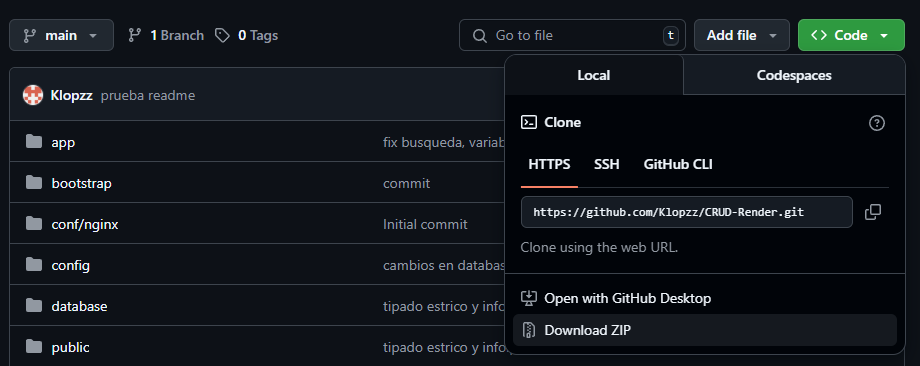

Paso 2.
Extraer los archivos en la ruta “C:\laragon\www” :  
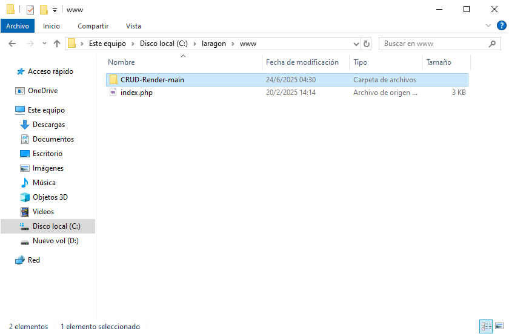

Paso 3
Debemos instalar composer en nuestro laragon (en la ruta que se ve en la imagen), seria darle next hasta que finalize y luego reiniciar la computadora (esto ultimo en caso de haber tenido instalado composer en otra ruta previamente:

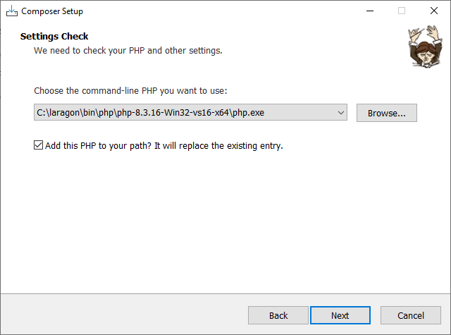

Paso 4.
Descomentar la línea extensión=zip dentro del archivo php.ini de nuestro laragon en la siguiente ruta:
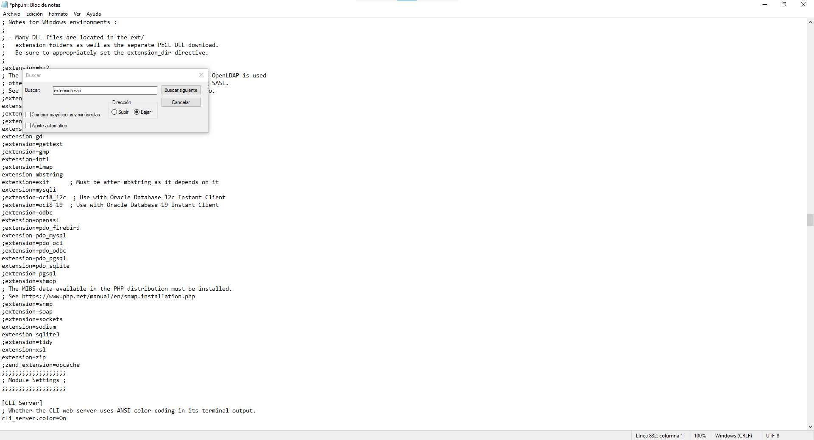

Paso 5.
Abrimos nuestro proyecto con Visual studio,Abrimos una nueva Terminal e ingresamos el siguiente comando para descargar las dependencias necesarias.
                        “composer install”
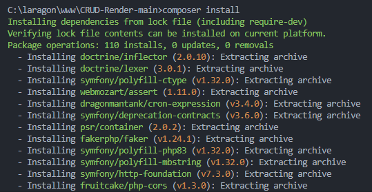
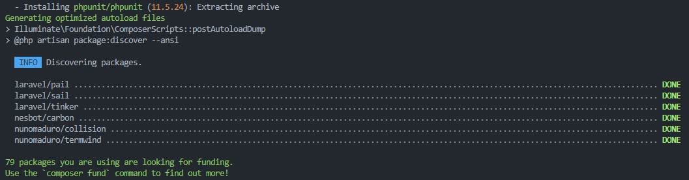

Paso 6.
Debemos ejecutar las siguientes dos líneas de comando:
                        copy .env.example .env
                        php artisan key:generate

En el Proyecto viene el .env.example, con la primera línea generamos una copia que se llama .env (que es la que usaremos) y con la segunda generamos la app_key que ns faltaba en nuestro nuevo archivo “.env”
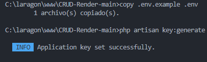
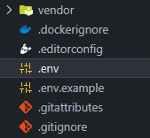
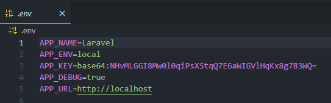

Paso 7.
En el archivo “.env” debemos descomentar la sección de la conexión de la base de datos cambiando colocando los datos de nuestra base de datos. 
> [!NOTE]
>Nota: podemos utilizar una base de datos mysql (laragon la trae configurada por defecto ya que genera una base de datos al crear un proyecto laravel a través del Quick menú) pero tendríamos que cambiar la sintaxis de nuestras migraciones. La segunda opción es instalar postgresql en Laragon y crear un usuario y una instancia en Heidi(botón de base de datos en Laragon)):

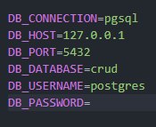
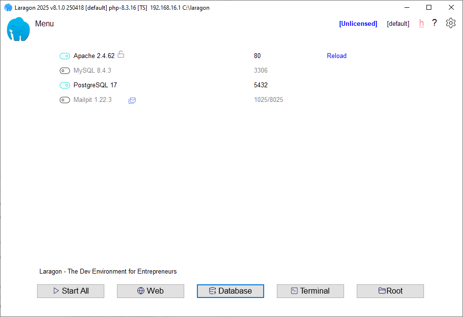
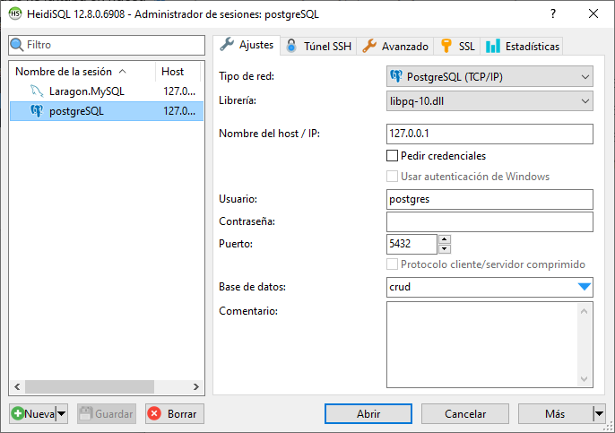

Paso 8.
Ejecutar las migraciones en nuestra consola con el siguiente comando:
                        “php artisan migrate”
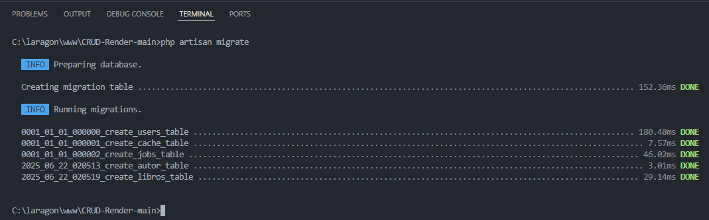
Podemos apreciar que se crearon nuestras tablas en el especial la tabla autor y la tabla libros que son las tablas que utilizamos en este proyecto.
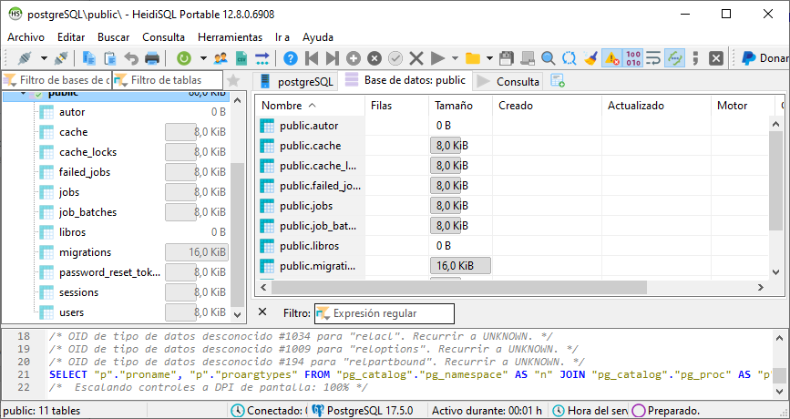

Paso 9.
Laragon nos da una gran facilidad, para ingresar a nuestro localhost basta con abrir el navegor e ingresar  “nombre_de_la_carpeta_de_tu_proyecto”.test:
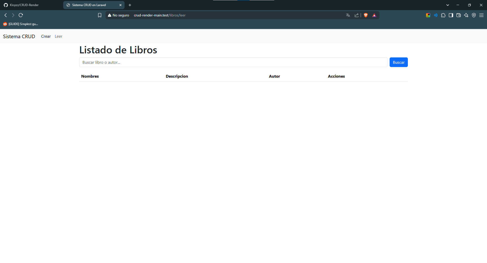

O podemos mostrar tambien nuestro proyecto atraves de la interfas de Laragon de la siguiente manera Menu->www->Nombre de tu proyecto:
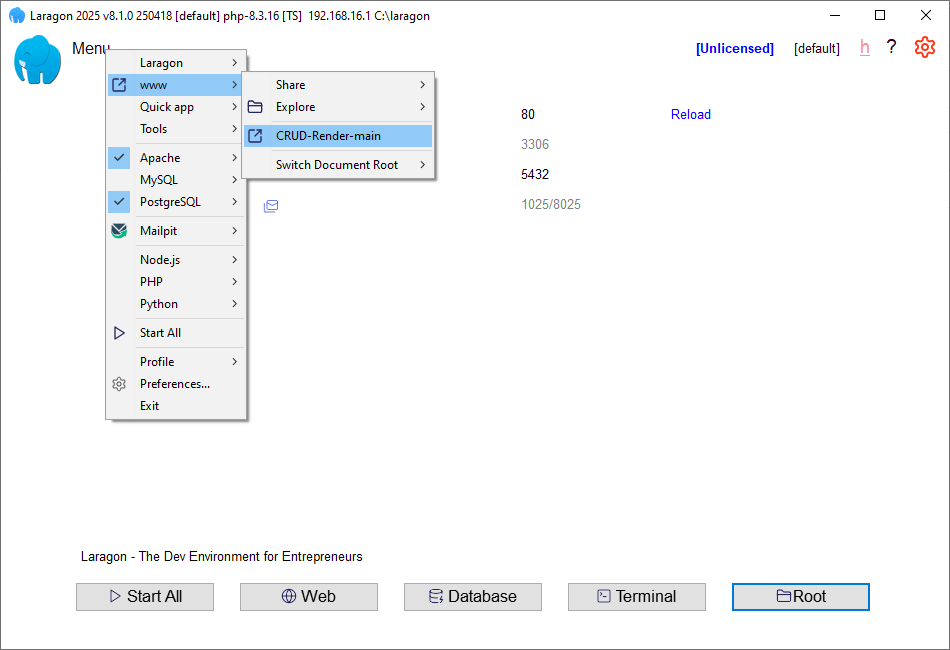

Y con esos hemos terminado de instalar nuestro proyecto de backend con php.

---

## ⚙️ Tecnologías utilizadas

-  Laravel 12.19.3
-  Laragon 8.1.0
- PHP 8.3.16
- PostgreSQL 17
